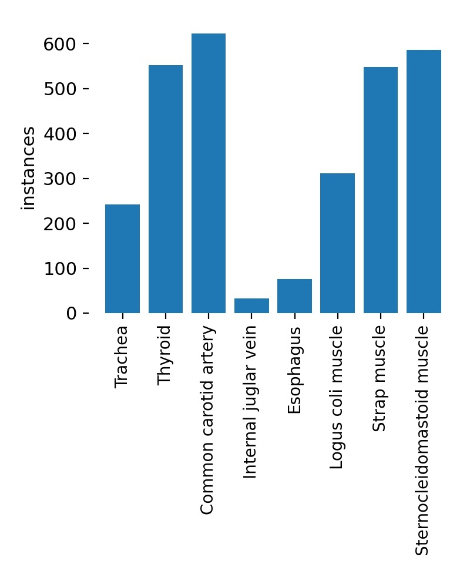
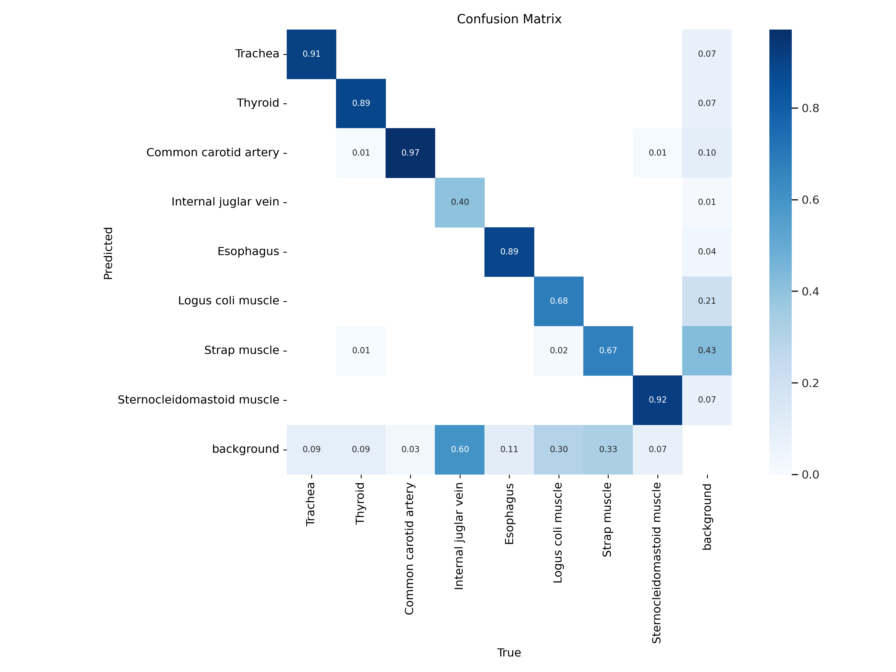

# Neck-Ultrasound-Dataset
**NNUS: Large Dataset for Normal Neck Organ Detection in Ultrasound**

**Summary statement**

Ultrasound images of the neck are often noisy and artifacts, requiring extensive experience to accurately identify the human organ. Therefore, image detection models trained on a large dataset for <b>Normal Neck Ultrasound (NNUS)</b> images have the potential to help radiologists and sonographers in real time. It can also be used for educational purposes for students learning radiology and can be usefully used to distinguish it from normal people by adding a dataset containing abnormal neck lesions.

The anatomical appearance of the normal person's neck and ultrasound images of the organs and its label dataset can shorten the time for many researchers to scan and collect the normal person's neck for their research. In addition, many researchers can develop new models using their datasets and extra-validate their studies using these datasets.

**Abstract**
- Our NNUS dataset consists of 790 normal human neck ultrasound images and their labels.
- We trained 100 epochs using YOLOv5s pretrained model and obtained mAP 0.8044, precision 0.7952, recall 0.8082.
- For the validation of the model we have learned, we input the newly scanned normal person's neck ultrasound video, and we were able to obtain the video which detected organs in the neck area as shown below.

<b>[Click on the image below to play the video]</b>

https://user-images.githubusercontent.com/26860786/214289321-bdba99fd-1b7f-4e2f-96bc-7bb087257142.mp4

## Table of Contents
- [Structure of Dataset](#structure-of-dataset)
- [Usage](#usage)
- [Results of Training](#results-of-training)
- [Acknowledgements](#acknowledgements)
- [Citation](#citation)

## Structure of Dataset
        NNUS/
        ├── images
        │   ├── 0001.jpg       <- Ultrasound images
        │   ├── 0002.jpg
        │   └── 0003.jpg
        └── labels
            ├── 0001.txt       <- Label 
            ├── 0002.txt
            ├── 0003.txt
            └── classes.txt    <- Class
### Images
All images are composed of 494×447 pixel jpg format files.
All shots were taken from 25 volunteers (average age 24.5 ± 3.5 years), presumed to be disease-free, ultrasound images of the neck.

More than 3 Shingu College (Seongnam, Republic of Korea) sonography students participated in the scan.
This dataset is the result of scanning and extracting images using LOGIQ P6 (GE healthcare, Connecticut, U.S.). Three types of scanning methods (longitudinal, transverse, and oblique scan) were randomly applied, and scanned about 30 to 40 images per person.

### Labels
Two radiologic technologists (11 years and 6 years of experience) used Label-Img (Tzutalin. LabelImg. Git code (2015). https://github.com/tzutalin/labelImg) to label the trachea, thyroid, common carotid artery, internal jugular vein, esophagus, longus colli muscle, strap muscle, and sternocleidomastoid muscle with bounding boxes.

The location information of these boxes was converted into coordinates and saved as a text file. The total number of labels is as follows.

## Usage
AI using datasets can be trained using object detection models such as YOLO.

We identified training performance using the YOLOv5s pre-learning model (Jocher, G. (2020). YOLOv5 by Ultralytics (Version 7.0) [Computer software]. https://doi.org/10.5281/zenodo.3908559).

1. Open the [nnus_train_and_valid.ipynb](https://github.com/joo053/Neck-Ultrasound-Dataset/blob/main/nnus_train_and_valid.ipynb) file on Github and click the "Open in Colab" button.
2. Execute the code line by line from the top. (Press the left play button on each code, or click on the code and press Shift+Enter.)
3. When you run python train.py, you can change the parameters you want and proceed with training. (For example, you can change the weight from yolo5s.pt to yolo5m.pt.)
4. When train.py is all done, you can get a model file named /content/yolov5/runs/detect/exp/weight/best.pt.
5. Run detect.py. Test.mp4, which was never used for training, is detected through the best.pt model.
6. After detect.py is completed, open /content/yolov5/runs/val/exp/test.mp4 to visually validate whether human organs are well detected.

## Results of Training
- best epoch: 90
- mAP_0.5: 0.8044
- mAP_0.5:0.95: 0.4717
- precision: 0.7952
- recall: 0.8082

## Acknowledgements
This code borrows from
- Jocher, G. (2020). YOLOv5 by Ultralytics (Version 7.0) [Computer software]. https://doi.org/10.5281/zenodo.3908559
- Tzutalin. LabelImg. Git code (2015). https://github.com/tzutalin/labelImg

## License
CC BY-NC-SA 4.0

When publishing a research paper using a dataset, the following citations must be included.

## Citation
Joo Young Oh, Euihwan Jeong, Moo Jin Jeong, Lee Joo Young, Hoon-Hee Park (2023). NNUS: Large Dataset for Normal Neck Organ Detection in Ultrasound. https://github.com/joo053/Neck-Ultrasound-Dataset
